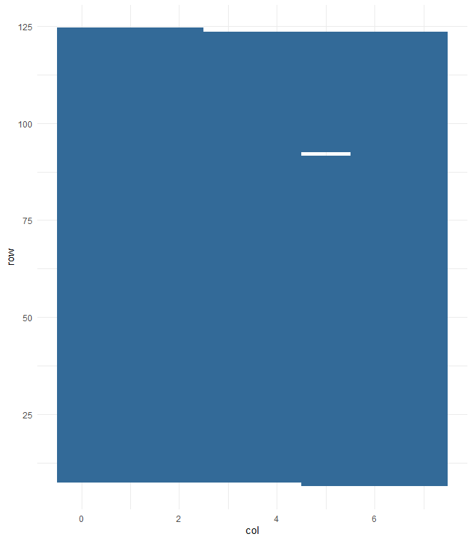

## Challenge 1

    library(readr)
    library(dplyr)
    library(stringr)

    input <- read_fwf(here::here("data/input_5.txt"), fwf_widths(c(7, 3)))

    colnames(input) <- c("row", "col")

    decode <- function(str_vector, one = "B", zero = "F"){
      str_vector %>% 
        str_replace_all(one, "1") %>% 
        str_replace_all(zero, "0") %>% 
        strtoi(base = 2)
    }

    max(decode(input$row) * 8 + decode(input$col, one = "R", zero = "L"))

    ## [1] 994

## Challenge 2

    library(ggplot2)

    data.frame(row = decode(input$row), col = decode(input$col, one = "R", zero = "L"), occ = 1) %>% 
      ggplot(aes(y = row, x = col, fill = occ), colour = "black") + geom_tile() +
      theme_minimal()

